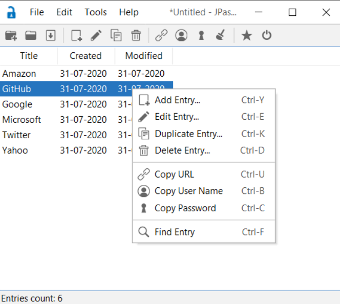

# JPass — Security Analysis & Vulnerability Assessment

> This repository is a **security analysis project** based on [JPass](https://github.com/gaborbata/jpass) by [gaborbata](https://github.com/gaborbata). All original application code belongs to the original author. This fork was created solely for academic security research purposes.

---

## About This Project

JPass is an open-source Java-based password manager that uses AES-256-CBC encryption to protect user credentials. This project performs a comprehensive security audit of JPass — analyzing its source code for vulnerabilities, producing formal UML documentation, writing a regression test suite, and proposing concrete architectural improvements to harden the application against real-world attacks.

**Team:** Haleema Abid, Samreen Shoukat, Hamna Saleem
**Course:** Software Security and Design — Air University Kamra Campus
**Institution:** Air University Kamra Campus (AACK)

---
## Application Preview


## Repository Structure

```
JPass_Secure/
├── master branch  →  Original JPass source code + JUnit 5 test suite
└── main branch    →  All diagrams, reports, and documentation
```

> **Note:** To explore the source code and tests, switch to the `master` branch. For project reports, diagrams, and presentation files, switch to the `main` branch.

### Master Branch
- Complete original JPass application source code
- Our added JUnit 5 test files covering core modules

### Main Branch
- `JPass_FinalReport.pdf` — Complete security analysis report
- `JPass_BufferOverflowVulnerabilityReport.pdf` — Detailed vulnerability findings
- `JPass_ArchitectureDiagram.pdf` — System architecture diagrams
- `JPass_ClassDiagram.pdf` — UML class diagrams
- `Abuse Case Diagram.html` — Abuse case diagram (open in browser)
- `JPass.pptx` — Project presentation slides

---

## Original Application Overview

JPass is a simple, small, portable password manager with strong encryption. It allows users to store usernames, passwords, URLs, and notes in an encrypted file protected by a single master password.

**Original Features:**
- AES-256-CBC encryption with PBKDF2-HMAC-SHA-256 key derivation
- Portable — single JAR file, can be run from a USB stick
- Built-in random password generator
- XML-based data import and export
- Supports Java 8 and later

| | |
|---|---|
| Original Author | [gaborbata](https://github.com/gaborbata) |
| Original Repository | [github.com/gaborbata/jpass](https://github.com/gaborbata/jpass) |
| Language | Java |
| Build Tools | Maven / Gradle |

---

## Our Security Analysis

### Methodology

The analysis followed a structured static security testing approach:

- **Manual source code review** across all Java source files
- **Vulnerability classification** by type, severity, and location
- **Test-driven verification** using JUnit 5 to confirm behavior at boundaries
- **Architecture review** to identify design-level weaknesses
- **Improvement proposal** with concrete hardening recommendations

### Vulnerability Summary

| Vulnerability Type | Count | Description |
|---|---|---|
| Logical Buffer Overflow | Multiple | Incorrect boundary assumptions in logic flow |
| Heap Buffer Overflow | Multiple | Unchecked memory allocation on user-supplied data |
| Boundary Check Failures | Multiple | Missing or insufficient input length validation |
| Padding Oracle (CBC) | Identified | CBC decryption path exposes padding error timing |
| **Total** | **31** | **Across ~28 Java source files** |

### Key Findings

- **Padding Oracle Vulnerability** — The CBC decryption implementation does not apply constant-time comparison, making it potentially susceptible to padding oracle attacks. An attacker with repeated oracle access could decrypt ciphertext without the master password.
- **Heap Buffer Overflows** — Several entry handling and XML processing classes allocate buffers based on user-supplied input length without upper bound checks, leading to potential heap corruption.
- **Logical Buffer Overflows** — Incorrect assumptions about input size in string and array operations across multiple utility classes.
- **Boundary Check Failures** — User input fields including title, URL, username, and notes lack enforced maximum length validation, allowing oversized data to propagate into internal buffers.

### UML Documentation Produced

- Use Case Diagram
- Class Diagram
- Sequence Diagram
- Activity Diagram
- Abuse Case Diagram

---

## JUnit Test Suite

A JUnit 5 regression test suite was developed to verify application behavior and expose boundary conditions across core modules.

| Test File | Module Covered |
|---|---|
| `JPassStreamTest.java` | Stream handling and I/O operations |
| `MenuActionTest.java` | Menu action dispatching |
| `UiComponentTest.java` | UI component initialization |
| Additional test files | XML, clipboard, constants, utilities |

**Total Tests Written: 127+**

Tests were written using Maven and JUnit 5 in VS Code. GUI-dependent classes were excluded from direct unit testing as they require display context.

---

## Architectural Improvement Proposal

Based on the findings, the following hardening measures were proposed:

| Area | Current State | Proposed Improvement |
|---|---|---|
| Encryption | AES-256-CBC | Migrate to AES-256-GCM (authenticated encryption) |
| Key Derivation | PBKDF2-HMAC-SHA-256 | Increase iteration count + add Argon2 option |
| Authentication | Master password only | Add MFA support |
| Memory Storage | Plaintext in-memory | Encrypted in-memory storage with secure wipe on exit |
| Integrity | No HMAC on file | Add HMAC verification before decryption |
| Input Validation | Minimal | Enforce strict maximum length on all input fields |
| CBC Decryption | Timing-vulnerable | Replace with constant-time comparison |

---

## Authors

**Haleema Abid** — [0xhaleema.github.io](https://0xhaleema.github.io) · [GitHub](https://github.com/0xhaleema)
, **Samreen Shoukat**
, **Hamna Saleem**

BS Cybersecurity — Air University Kamra Campus

---

## Disclaimer

This project was conducted strictly for academic and educational purposes as part of a university course on Software Security and Design. No malicious use of the identified vulnerabilities is intended or endorsed. All findings were reported within the scope of the course assignment.
